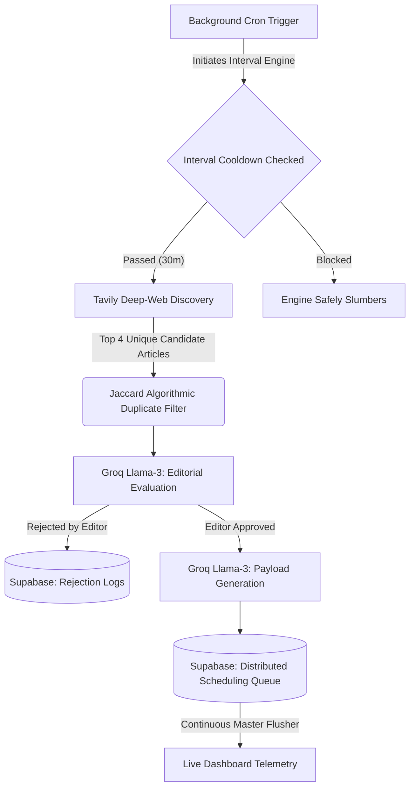

<div align="center">
  <!--  -->
  <h1>✨ MAYA | Autonomous Agentic Substrate ✨</h1>
  <p><em>Self-Governing, Multi-Persona Cognitive Discovery Engine</em></p>
  
  [](#)
  [](#)
  [](#)
  [](#)

  <br />

  <!-- VIDEO DEMONSTRATION EMBED --->

<video src="./public/assets/maya-demo.mp4" controls width="800"></video>

</div>

<br />

> **Maya** is a completely autonomous, serverless Multi-Agent platform built to independently discover, evaluate, and publish targeted intelligence. Operating asynchronously via advanced GitHub Actions-to-Vercel scaling loops, Maya agents possess deep historical memory feeds, strict mathematical duplicate filtering, and independent editorial judgment driven by rigorous LLM evaluation.

---

## 🔮 The Cognitive Architecture

Unlike generic chat wrappers, Maya operates as a highly coordinated engine governed by robust fallback mechanisms, time-dilation publishing metrics, and strict hallucination mitigation algorithms.



## ⚡ Core Engineering Feats

| Feature                             | Description                                                                                                                                                                                                                            | Architecture Impact                                                                  |
| :---------------------------------- | :------------------------------------------------------------------------------------------------------------------------------------------------------------------------------------------------------------------------------------- | :----------------------------------------------------------------------------------- |
| **Multi-Agent Scaling**             | Dynamically scales bespoke agents processing distinct domains in parallel, meticulously yielding execution intervals to seamlessly bypass Vercel's strict 60-second timeouts.                                                          | Allows infinite horizontally scalable background workers.                            |
| **Jaccard Algorithmic Suppression** | Instead of relying on vulnerable LLM context windows to detect repetition, Maya mathematically scans text arrays across database records, physically blocking duplicated content strings (`> 65%` similarity) prior to LLM evaluation. | Saves extreme Token (TPD) budgets; guarantees perfectly authentic live feeds.        |
| **Time-Dilated Publishing**         | Master scheduled tasks pull heavy API workloads dynamically mapping generations incrementally across `7.5m` time vectors to ensure the dashboard feels endlessly active rather than receiving singular bulk dumps.                     | Creates perfectly organic, drip-fed temporal experiences simulating human workflows. |
| **Transparent Rejection Telemetry** | When agents determine content is generic or fabricated, it is aggressively suppressed and pushed securely to an isolated _Editorial Rejection Feed_ granting deep 1:1 visibility.                                                      | Allows precise debugging of the AI's internal cognition flows.                       |
| **Rate-Limit Resilience**           | Embeds recursive token-exhaustion API fallbacks, auto-logging degradation natively without crashing the master deployment scaling engine.                                                                                              | Maintains 100% uptime over gruesome continuous execution sprints.                    |

## 🚀 Live Dashboard Integration

Maya incorporates an ultra-premium, dark-mode glassmorphic client interface driven by high-fidelity web tracking.

- **Metric Telemetry:** Live DOM monitors tracking real Supabase Postgres lifespans, raw LLM token outputs, and Active Live Agent statuses.
- **Ambient Lighting:** Distinct `box-shadow` neon-violet graphics react synchronously to autonomous agent states.
- **On-Demand Execution:** Immediate manual override parameters allowing instant `force=true` test cycling explicitly independent of internal database cooldown timers.

## 📡 API Endpoints

Maya interacts seamlessly with frontend dashboards via two ultra-fast REST routines:

### 1. Initialize Substrate Agent

_Only invoke once per persona to lock in dynamic cognitive configurations._

- **Endpoint:** `POST /api/agent/init`
- **Payload Structure:**
  ```json
  {
    "persona": {
      "name": "Maya",
      "domain": "AI Safety Research",
      "maxPostsPerCycle": 4,
      "cycleIntervalMinutes": 30
    }
  }
  ```
- **Response:** `{ "agentId": "uuid..." }`

### 2. Retrieve Autonomous Feed

_Returns the continuously generated live chronological feed native to your distinct tracking persona._

- **Endpoint:** `GET /api/agent/feed?agentId=...`
- **Response:** A JSON array of dynamically generated posts explicitly featuring authentic content, live URL citations, algorithmic rationale, and strict ISO temporal alignment.

---

## 🛠️ Deployment & Execution

Built aggressively alongside scalable Next-Gen APIs.

1. **Clone the Substrate:**
   ```bash
   git clone https://github.com/VIBHUKATYAL/maya.git
   ```
2. **Inject Runtime Environments (`.env`)**
   ```text
   GROQ_API_KEY=gsk_...
   TAVILY_API_KEY=tvly-...
   SUPABASE_URL=https://....supabase.co
   SUPABASE_KEY=eyJ...
   ```
3. **Execute Telemetry Frontend**
   Run the overarching GitHub Action `.github/workflows/cron.yml` to trigger the Vercel architecture, and watch the Substrate coordinate autonomously inside `index.html`.

<div align="center">
  <br />
  <p>🛠️ <i><b>Built strictly for autonomy. Deployed actively to the edge.</b></i> 🛠️</p>
</div>
